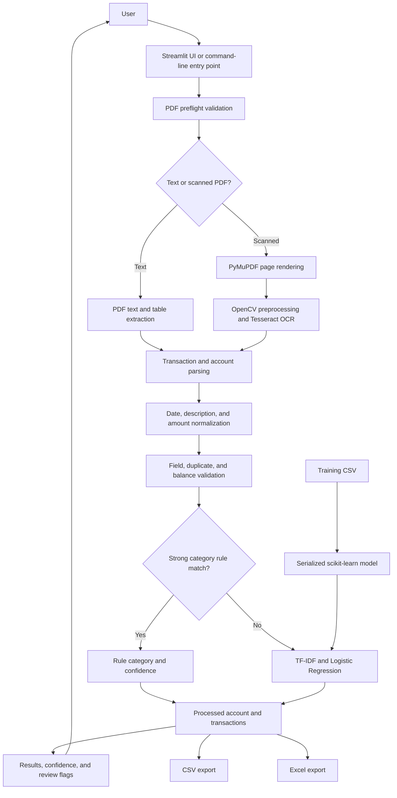
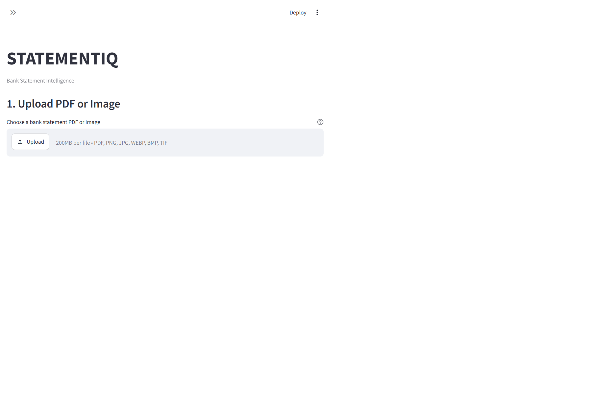
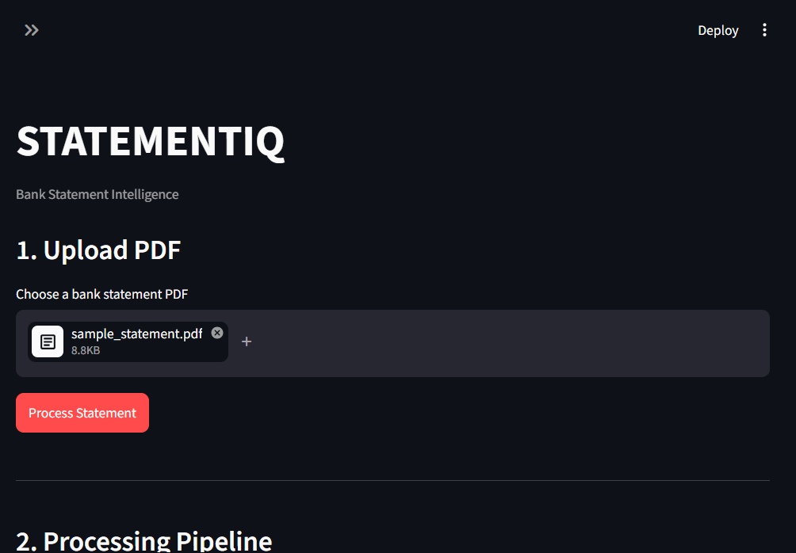

# STATEMENTIQ: Bank Statement Intelligence

STATEMENTIQ is a local-first prototype for turning bank statement PDFs and raster images into normalized, validated, categorized transaction records. It supports text-based PDFs directly and scanned PDFs or images through an optional Tesseract OCR installation. Classification uses keyword rules and a scikit-learn model; no LLM is used.

> This is an engineering prototype, not a financial reconciliation service. Review extracted values and classifications before relying on them.

## 1. Project Overview

The application accepts a statement PDF, detects whether it contains extractable text, extracts account and transaction data, normalizes fields into a common schema, flags data-quality concerns, assigns categories, and provides CSV and Excel downloads.

The web interface is built with Streamlit. The processing pipeline can also be called from the command line or imported from `app.pipeline`.

## 2. Problem Statement

Bank statements vary in layout, column labels, date conventions, amount separators, and whether the PDF contains text or scanned page images. Manual re-entry is slow and error-prone, while a single rigid parser can fail when a bank changes its statement format.

This project provides a structured extraction and review workflow. It standardizes common transaction fields and surfaces uncertainty instead of treating every extracted value as verified.

## 3. Features

- Upload text-based or scanned PDFs, or PNG, JPEG, WEBP, BMP, and TIFF statement images through the Streamlit interface.
- Detect PDF type and extract account metadata and transaction rows.
- Normalize dates, descriptions, debit/credit values, and balances.
- Validate transaction fields, potential duplicates, and running balance continuity.
- Classify transactions with keyword rules and a TF-IDF / Logistic Regression fallback.
- Show classification method, confidence, validation status, and review notes.
- Filter the transaction table by category and classification method.
- Download a CSV file or a three-sheet Excel workbook.
- Use included synthetic sample statements and scenario fixtures for testing.

## 4. Architecture



The main modules are organized by pipeline responsibility: `app/ingestion`, `app/extraction`, `app/normalization`, `app/validation`, `app/classification`, and `app/export`. `app/pipeline.py` coordinates these stages. `app/main.py` provides the user interface, and `run.py` starts the UI or invokes the pipeline for a PDF.

## 5. Processing Pipeline

1. Validate the input file and open the PDF.
2. Detect whether sampled pages contain enough extractable text.
3. Extract text directly, or render and OCR scanned pages.
4. Parse account metadata and candidate transaction rows.
5. Normalize dates, descriptions, and monetary values.
6. Validate transaction fields, duplicates, and running balances.
7. Apply strong keyword rules, then use the ML model as a fallback.
8. Return the results to the UI and optionally export them.

Rows that cannot be normalized into date-stamped transactions are normally skipped as header/footer noise. Financial rows with an explicit date-format placeholder are retained with a blank date and marked invalid/Needs Review; the system does not fabricate missing dates. Validation warnings are attached to transactions rather than silently removing them.

## 6. PDF Detection

Before type detection, the PDF validator checks that the file exists, is non-empty, has a `%PDF-` header, is readable, is not encrypted, and contains at least one page. Encrypted, malformed, and empty documents produce processing errors.

The detector samples up to the first three pages using `pdfplumber`. If any sampled page yields at least 50 non-whitespace characters, the document is treated as text-based; otherwise it is treated as scanned/image-based. This is a lightweight heuristic, not a complete mixed-document classifier.

## 7. Text Extraction

For text-based PDFs, `pdfplumber` extracts page text. Account details are searched for in the first two pages. Transaction rows are parsed using statement text and table-layout heuristics, then represented as `Transaction` objects before normalization.

Extraction depends on the PDF's text order and layout. A valid PDF can still fail if its table structure or labels do not match the parser's assumptions.

## 8. OCR Pipeline

For a scanned PDF, PyMuPDF renders each page at 300 DPI. OpenCV converts the image to grayscale, applies a light Gaussian blur, uses Otsu thresholding, and performs morphological opening before Tesseract recognizes the text. OCR output is split into lines and passed to the transaction line parser. Raster images uploaded through the UI are decoded with OpenCV and wrapped in a temporary, single-page PDF, then follow this same OCR path.

`pytesseract` is only the Python integration. The separate Tesseract OCR executable must also be installed and discoverable on the system. If a scanned document is detected while Tesseract is unavailable, the pipeline attempts text extraction as a fallback; image-only pages generally will not yield usable transactions that way.

## 9. Normalization

Transactions are normalized to the common fields `date`, `description`, `debit`, `credit`, and `balance`, independent of the original statement's column names. The normalizers handle common date formats, currency symbols, Indian and international grouping, decimal separators, whitespace, and Dr/Cr markers.

Multiline descriptions are collapsed to readable text. For OCR rows with yearless dates such as `06/01`, the year is taken from the statement period; date order is inferred from unambiguous full dates when available. When debit/credit direction is unclear, running-balance continuity is used when it matches the amount within 0.05 currency units. Otherwise, direction is inferred from Dr/Cr markers and description keywords, with ambiguous rows defaulting to debit. Check these inferences against the source statement.

## 10. Validation

The validator checks dates, descriptions, numeric amounts, and balances. It also flags exact potential duplicates based on date, debit, credit, and normalized description. Running balances are checked using:

```text
expected balance = previous balance + credit - debit
```

A difference greater than 0.05 currency units is marked as a warning. Invalid fields, duplicate candidates, and balance mismatches are recorded in each transaction's validation status and notes. A warning does not mean the source transaction was corrected.

## 11. Classification

Classification is hybrid and non-LLM:

1. The rule classifier checks descriptions against category keyword lists. A strong match (default confidence threshold 0.8) is accepted directly.
2. If no strong rule matches, the transaction is sent to the ML classifier.

The UI and exports identify whether each category came from rules or the ML model. ML confidence below 0.60 is marked `Needs Review`; users should also inspect validation warnings independently of that confidence flag.

## 12. ML Approach

The model cleans transaction description text, vectorizes unigrams and bigrams with TF-IDF, and predicts a category using scikit-learn Logistic Regression. The trained pipeline is stored at `models/classifier.pkl` using joblib. Training data is read from `data/train_transactions.csv` and must contain `description` and `category` columns. If the model file is missing, the application attempts to train it from that CSV.

The displayed confidence is the model's maximum class probability, not a guarantee of correctness or a calibrated financial risk score. The model is limited to patterns and categories represented by its training data. Use a compatible scikit-learn version when loading a persisted model; serialized estimator compatibility can change between library versions.

## 13. Export

- **CSV:** transaction date, description, debit, credit, balance, category, classification method, confidence, and validation status.
- **Excel:** a `Transactions` sheet, an `Account Details` sheet, and a category `Summary` sheet. The transaction sheet also includes review status.

The interactive table additionally displays validation notes and review status. Those UI-only columns are not currently included in the CSV schema.

## 14. Installation

Use Python 3 and install the project dependencies from the repository root:

```powershell
python -m venv .venv
.venv\Scripts\Activate.ps1
python -m pip install --upgrade pip
python -m pip install -r requirements.txt
```

On macOS or Linux, activate the environment with `source .venv/bin/activate`. Scanned-PDF support additionally requires installing the Tesseract executable through your operating system's package manager or installer; installing `requirements.txt` alone does not install that executable. Confirm the `tesseract` command is available on `PATH`.

## 15. Usage

Start the web application from the repository root:

```bash
python run.py
```

Open the local Streamlit URL printed in the terminal, upload a PDF or a PNG, JPEG, WEBP, BMP, or TIFF image, select **Process Statement**, review the results and download an Excel or CSV file. Image uploads and scanned PDFs require Tesseract OCR. The included synthetic statement is `data/sample_statement.pdf`.

The same pipeline can be run without the web interface:

```bash
python run.py data/sample_statement.pdf output.csv
python run.py data/sample_statement.pdf output.xlsx
```

If no export path is supplied, the command-line entry point writes `transactions.csv`. The pipeline is also callable from Python as `app.pipeline.process_pdf_pipeline(pdf_path, export_path=...)`.

### Screenshots

**Upload**



**Processed results**



The results screenshot uses the included synthetic sample statement.

## 16. Testing

Run the unit and integration suite from the repository root:

```bash
python -m pytest -q
```

Tests cover parsing and normalization, classification, validation, exports, error handling, logging, and the end-to-end pipeline. Synthetic scenario PDFs and their generator are in `data/scenarios/` and `data/generate_real_world_scenarios.py`.

## 17. Edge Cases

The test fixtures exercise common variations including:

- Date strings such as `15-Oct-2025`, `01 Sep 2026`, and OCR dates without a year when a statement period supplies one.
- Indian and European amount formats such as `₹ 1,23,456.78`, `1 234,56`, and `1.234,56`.
- Multiline descriptions and rows with missing debit/credit columns.
- Duplicate-looking transactions and inconsistent running balances.
- Low-confidence predictions, invalid PDFs, and export generation.

These are targeted regression cases, not a guarantee that every bank's statement layout or OCR output will be parsed correctly.

## 18. Limitations

- PDF type detection samples only the first three pages and uses a character-count threshold; mixed text/scanned PDFs may be misrouted.
- Table extraction is heuristic and is not a bank-specific layout engine. Unfamiliar layouts can omit, merge, or misread rows and columns.
- OCR accuracy depends on scan quality, page orientation, language, and Tesseract configuration. OCR output is not independently verified against the source image. Image uploads are currently processed as one page each.
- Account metadata extraction is best-effort and searches only the first two pages.
- Debit/credit inference for incomplete rows can be ambiguous; inferred values need human review.
- Confidence is not a calibrated probability of financial correctness. The model can be affected by limited training data and scikit-learn version drift.
- The app has no user authentication, multi-user controls, persistent audit workflow, or human correction/retraining interface. Do not treat it as a hardened production service.

## 19. Future Improvements

- Add bank-specific extraction profiles and stronger table reconstruction for varied and multi-page layouts.
- Measure extraction and classification quality against a larger, consented, representative dataset.
- Surface OCR quality signals and provide editable corrections with an auditable review workflow.
- Add model versioning, reproducible training, probability calibration, and drift monitoring.
- Improve privacy controls, deployment security, batch processing, and configurable export schemas.
